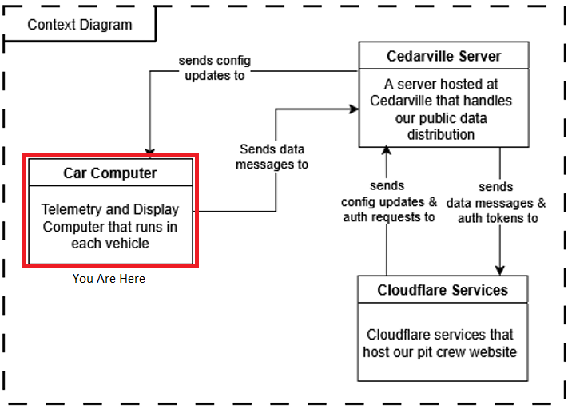
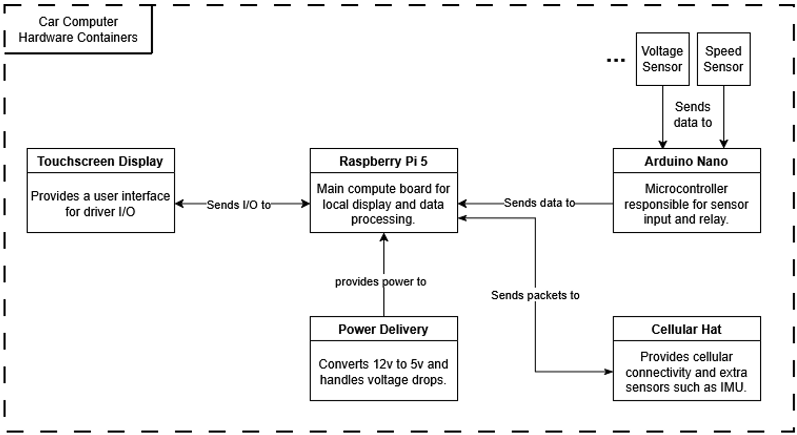
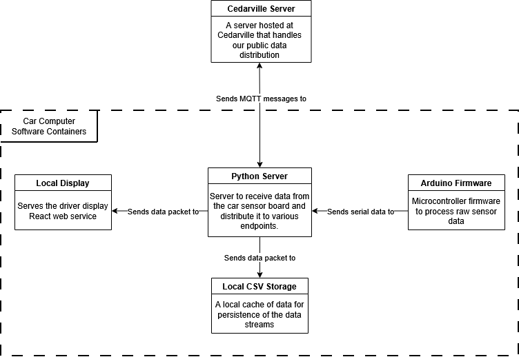

The car computer system is the only one for which we maintain hardware and software for. Both pieces are described on this page.

## Hardware
Our computer's hardware is composed of a few different parts, each performing quite different functions. I will break the system down according to the general functionality groupings: Sensors, Data Processing, and Power Delivery. You can reference the diagram below for a full scale depiction of our computer system right now. 

Don't worry if it seems like a lot at the moment, hopefully after the explanations below the diagram will make more sense.

### Sensors
All of our sensor inputs are handled by a little microprocessor called an [Arduino Nano](https://store.arduino.cc/products/arduino-nano). This device is a DIY development board that allows us to handle inputs and outputs to and from different types of devices, and is used all over to control custom electronics projects. We use it here to handle intaking and parsing the data that we receive from the sensors in different places in the car.  

If you look inside the computer box, however, you will notice that our little board is not alone. It is set into a prototyping board which allows us to create the proper connections for our different sensors. Different sensors require some modification of the signal coming in through the means of resistors, and this prototyping board allows us to do these things. It also allows us to install the correct JST connector for the sensors so we are not permenantly mounting the sensors to the arduino, which would severely limit the portability of the computer box as a whole.  

The Arduino Nano, as you can see in the diagram above, is connected to the Raspberry Pi 5 (discussed below) via a USB serial connection by a USB mini-b to USB type-a cable. The arduino is not only powered through this USB connection, but it also sends the sensor data from the car in bulk to the Raspberry Pi with this connection.

### Data Processing
Once the Arduino sends the data, it is then received by the Raspberry Pi 5. A [Raspberry Pi](https://www.raspberrypi.com/products/raspberry-pi-5/) is a microcomputer designed for DIY electronics applications that require some flexibility and computing power. Since it is less powerful than a normal computer, it runs on a modified version of linux called Raspbian. It is slimmed down and simplified to require the smallest compute power possible to run.

This RPi is really the workhorse of the operation, running two software components to support data operations. The first is the python service, which handles data input and distribution. The second is the local webapp instance that hosts the driver display. Those two will be described more in the Software section.

The data distribution includes transmitting the data to remote servers, which requires some sort of wireless connection. We acheive this through a Cellular modem hat from [Ozzmaker](https://ozzmaker.com/product/ozzmaker-sara-r5-lte-m-gps-10dof/) mounted to the Pi, which uses the Hologram LTE-M network to communicate.

### Power Delivery
None of the above can happen unless the computer is receiving consistent power from the car. This acheived through a two-stage system. 

* <u>12v to 5v Buck Converter</u>  
This circuit takes in the 12 volt power coming from the car's battery, and converts it to a consistent 5v power that the computer can use. This part of the system is vital for the function of the computer. The computer connects to it using a built-in usb-a connection.

* <u>Capacitor Bank</u>  
When the gasoline car is started, the starter motor pulls a lot of amperage from the battery all at once. When this happens, a voltage drop occurs on the car's circuit, which can cause our computer to power cycle. To prevent this, the capacitor bank stores enough electricity to keep consistent power to the system during car start.

## Software

If you are looking for more developer-level documentation, I recommend taking a look at the docs in the respective repositories. The README.md files will give you a good idea of development procedure, and code commenting will provide class-level information.

### Local Display

**[Driver Display Repository](https://github.com/HEEV/supermileage-display-web)**

The driver display built in React serves as the dashboard for the drivers to be able to see the status of the cars. It displays only the most vital information to the drivers to avoid distractions, with those things being speed, windspeed, and simulation tracking. These three metrics allow the driver to optimize when they are burning the engine during the race.

The display receives the vehicle data from the Python Server via a local socket connection.

### Python Server

**[Pi Server Repository](https://github.com/HEEV/supermileage-pi-server)**

As you can probably tell from the diagram, the server is the traffic control of our data pipeline. It takes in the serial data from the Arduino, parses it, and sends it off to the various endpoints that we have. 

Specifically, the destinations of the data can be broken down into 3 locations: Driver Display, Pits Display, and Data Aquisition.

1. **Driver Display:** The primary goal of the RPi is to display information about the car to the driver. This is primarily through the means of the 7-inch touchscreen display mounted in the cockpit of the cars.
2. **Pits Display:** Optimally, the people in the pits can also see how the car is doing, so if something goes wrong communication and response can be swift. This happens through a cellular connection from the car to the Cedarville server, which then delivers data to the pits via a web interface.
3. **Data Aquisition:** Finally, it is good to be able to collect data from the car for later anaylsis, and to feed into the simulation code that has been developed for the past several years. Currently, this is primarily done through a CSV cache locally on the Pi.

### Arduino Firmware

**[Arduino Firmware Repository](https://github.com/HEEV/NewArduinoSensorController)**

The firmware runs on our Arduino Nano, and serves to collect and condition all of the sensor inputs it could expect to take in, and packages it to send over the serial bus. Through a packed struct, it is able to fit 10 different input values into a 23 byte packet, which allows for higher throughput on the serial bus. See the repository README for more information on that packet.