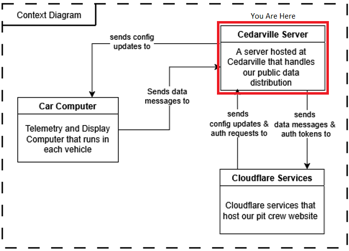
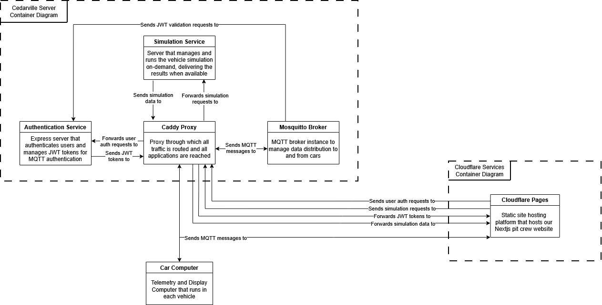

The Supermileage server hosted at Cedarville serves as the "interchange" through which our systems interact with one another. It controls authentication, data delivery, and data generation (simulation), meaning it is the single point of entry for all of the auxiliary needs of the systems we maintain. It breaks into 4 primary components: Caddy proxy, MQTT Broker, Express Auth Server, and the Simulation API. 

## Caddy Proxy

{: .info-title}
> Routing Pecularities
>
> To save you from the troubleshooting rabbit trail, there are some interesting behaviors as a result of the routing within Cedarville's network. Cedarville, for security and for load balancing, has a load balancer server between the outside world, and the server hardware our Supermileage VM runs on. This load balancer forwards *all* web traffic, no matter what port it originates from, to port 443 on our VM. So, even HTTP traffic will appear through port 443 on our VM. Weird, huh? We thought so too. See [this diagram](images/sm-network-diagram.png) to get a visual idea of what I am talking about.
> 
> Further, due to this setup, the public IP address of the server (through supermileage.cedarville.edu) is not the same as the on-campus one we use to manage the server.

The proxy serves as the single point of entry for our server. It takes in all of the requests on port 443, and then forwards them to all of our backend services depending on the URI path that was given by the client. The following is a list of the live endpoints on the server.

- **MQTT:** /mqtt*
- **Authentication:** /auth*
- **Simulation:** /api/*
- **Wiki:** /wiki (This just redirects here)

We chose to use Caddy as our proxy for this application because it is extremely lightweight and flexible, and has quite a low learning curve to get up and running for the first time. Even with this low complexity, it still supports industry standard secure practices such as HTTPS.

## MQTT Broker

Early in the design process, we knew we needed data transmission that was low-letency and low-data usage. Low-latency because the Pit Crew needs to know what is going on with the cars in real-time when they are on the track. Low-data because wireless connections on the track can be unreliable at best, so throughput will be lower than we would expect. The publisher-subscriber model for data transmission fits this bill quite nicely, as it supports on-demand data streams that do not have to be consistent to exist, and it can handle data as fast or as slow as it is provided (given it has enough resources allocated).

The MQTT protocol was picked specifically due to the fact that it is marketed as a low-bandwidth data solution for IoT devices and similar, that are sending streams of data from sensors over time. This matched exactly what we needed.

The broker we have deployed in our server is the [Mosquitto](mosquitto.org) broker. It is an open source broker provided by Eclipse that provides the basic things we needed to get up and running. We use a [custom image of the broker](https://github.com/iegomez/mosquitto-go-auth), however, that includes JWT authentication functionality as well (See why in the box below). 

{: .info-title }
> Broker Authentication
> 
> By default, the Mosquitto broker supports username/password authentication. On its own, this usually is not a problem. It became an issue, however, when we discovered that the MQTT module for Nodejs did not support server-side integration. That meant that the credentials for the broker were in the client browser, which is not ideal. 
> So, instead, we utilize the go-auth plugin for the broker to enable JWT authentication. Now the users get issued a JWT Token upon login and authenticate with that, so no credentials are leaked. The JWT management is provided by our [Authentication Server](/cedarville-server.md#express-authentication-server).

## Express Authentication Server

The authentication server solves two problems in our architecture. First, it provides a means to authenticate public users to our broker through JWT tokens, instead of exposing broker credentials. The other problem it solves is it provides reliable authentication for users on our pit crew website. It does not allow new user registrations, and can only be accesses through pre-created user credentials.

**Endpoints**
- **/auth/login** Checks user credentials, and if they are valid, returns a JWT token with a 5-minute expiration.
- **/auth/verify** Validates a JWT token to ensure it is valid for this server using the private key. This endpoint is only hit by the MQTT Broker.
- **/auth/acl** A dummy route to satisfy MQTT go-auth plugin requirements, it always returns 200. This endpoint is only hit by the MQTT Broker.

## Simulation API

The MATLAB simulation is a complete physics model-based simulation of our supermileage vehicles based on their attributes. Originally, we wanted to run this simulation on the Raspberry Pis to be able to directly display the output from the simulation onto the driver display so the driver could get immediate feedback on their driving strategy.

A choice we made early on, however, prevented us from doing this. Since the School of Engineering here at Cedarville is moving away from MATLAB, we wanted to transition off of the license as well. Due to lack of time, we decided to meet halfway, and use the MATLAB Runtime, which can be used without a license, and just converted the pure MATLAB to a python module that encapsulates the MATLAB code. The issue was, the MATLAB Runtime does not have a version that runs on Linux ARM architectures, which just so happens to be the architecture of a Raspberry Pi. So, we had to run it in the cloud.

This service is reachable through Python's FastAPI module. View the endpoints available below.

**Endpoints**
- **/api/runtime_con** Tells the MATLAB Runtime to spin up on the server.
- **/api/runtime_dis** Tells the MATLAB Runtime to shut down on the server.
- **/api/run_sim** Asks the server to run the simulation in MATLAB Runtime, and give us the resulting data.

Currently, the API returns data for simulating a car that is statically populated in the server. In the future, this API will allow parameters to choose which car to run a simulation for. This was more of a proof of concept.