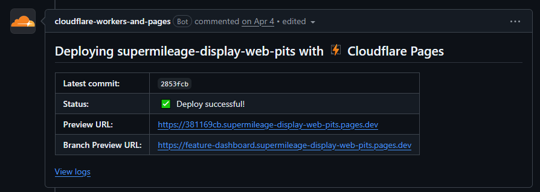
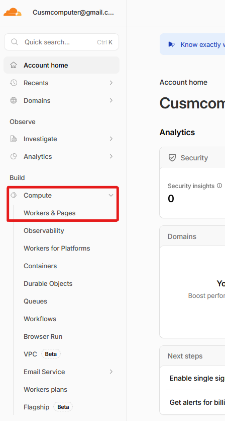
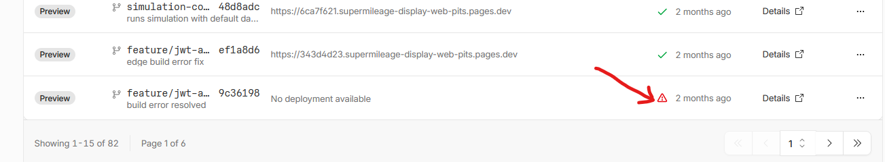

Due to time and complexity constraints, our Pit Crew dashboard is hosted in the cloud through Cloudflare. This choice was made for a few reasons, primary of which being that Cloudflare hosting is free with no strings attached. That was critical to remove the burden of maintaining financials for the server. The other reason for using Cloudflare is that their service, Cloudflare Pages, can deploy and manage Nextjs apps natively, making it super simple to get up and running and to keep it that way.

## Pit Crew Dashboard

Our pit crew dashboard is a Nextjs web application that allows the pit crew to view live data feeds from the supermileage cars. It performs a lot of MQTT interactions, both publishing data and consuming it. This MQTT interaction is the reason that we had to implement JWT authentication infrastructure, so that we could securely authenticate public users without exposing server credentials. Most functionality on the site is locked behind a login.

It performs three main functions. For more detailed walkthrough of the UI itself and how to use it, see the [user guide](./user-guides/pit-crew-website.md) on the interface.

### 1. Public Data Dashboard

The first accessible thing on the website is a basic public dashboard that allows the general public to view limited data coming from our cars. This is more of a PR stunt for our technology than anything else.

### 2. Private Pit Crew Dashboard

This dashboard serves all of the available vehicle data to the pit crew. It is locked behind a login, so only authorized users can see this information (see the [Cedarville Server](./cedarville-server.md#express-authentication-server) page for more info on how that works). Additionally, the pit crew also can send API calls to the [simulation server](./cedarville-server.md#simulation-api) running on the Cedarville cloud server, allowing them to send simulation data to the drivers over MQTT when needed.

### 3. Configuration Customization

The last major functionality of the site is a separate dashboard that allows the pit crew to modify the sensor configuration of the cars remotely, without having to access the file system of the computers. This allows for fast patching of new sensors into the system, as well as allowing for adustments of the configuration if sensors are not behaving as expected. The configuration is transmitted to cars over MQTT topics, and the dashboard is also locked behind login.

## Deployment

As mentioned above, deployment is simple for Cloudflare. In our case, we were able to integrate the deployment into Github Actions, so when changes are pushed to a branch a deployment is automatically started. If the changes are pushed to a feature branch, Cloudflare will automatically create a preview deployment so you can see the application as if it were deployed to production. When changes are merged into main, a production build is automatically created that seamlessly replaces the currently deployed one. If there are no problems, it should be completely hands off. 

### If Problems Arise (spoiler: they will)

Of course, things don't always work the first time. If the Github Action fails due to a problem on Cloudflare, you will have to log into the Cloudflare dashboard to check logs and find what problem needs to be resolved. To do this, you will need the Cloudflare credentials which you can get from the previous computer team lead. Once you log in, you will need to navigate to the Compute > Pages page. 

Once there, you will see a list of applications, and the pit crew website will be the only one listed. Click through that, and you will arrive atr the deployments screen. On this screen you will see all of the deployments attempted for the application. In the case of a failure, you will see a warning icon next to it indicating a failure.

If you click on the Details link for the problematic deployment, you will be able to view the logs of that deployment which should tell you what the problem was.

{: .info-title }
> Tip to Avoid Build Errors
>
> Many times, build errors are not some catastrophic failure. Rather, often there is some sort of eslint formatting issue that causes the failure. To catch these formatting issues early, I would recommend running the linting script that is built in to our repository, through the command `npm run lint`.