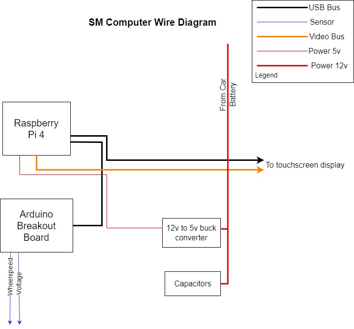

# System Overview

This page goes into the general details of what our computer systems do, how they integrate with the car, and what all parts are needed for it to work.  

## Why do we even need a Computer System?
This is a good question, especially since the car technically already has a computer in it, called MegaSquirt, for managing the tune of the engine. The answer is multi-faceted, as our computer actually serves multiple purposes for multiple teams.

### 1. Data Collection
Arguably one of the most important uses, our computer serves as an integral part of the data requisition from the car. While MegaSquirt tracks information about the engine tuning and efficiency, our system can track the overall performance of the car. We can track metrics such as vehicle speed, battery voltage, engine temperature, car status and more. This allows the other teams to analyze the performance of the car, and simulate the car to find how the car could theoretically perform in different conditions.

### 2. Driver Telemetry
While having the data for the engineers of the team is a vital function, the other half of our responsibility is to display some of this data to the drivers. They need to know a summary of how the car is driving and functioning, allowing them to make decisions about when to run the engine, when to coast, and what decisions need to be made about the mechanical condition of the car. This is all shown on a 7 inch display mounted inside the car, which we will discuss in a bit more detail a bit further down on this page.

### 3. ???

## How It Works
Now I am going to dig into some of the more technical details about how our system functions, from a hardware and a software perspective.

### Hardware
Our computer's hardware is composed of a few different parts, each performing quite different functions. I will break the system down according to the general functionality groupings: Sensors, Data Processing, and Power Delivery. You can reference the diagram below for a full scale depiction of our computer system right now. 

Don't worry if it seems like a lot at the moment, hopefully after the explanations below the diagram will make more sense.

#### Sensors
All of our sensor inputs are handled by a little microcomputer called an [Arduino Nano](https://store.arduino.cc/products/arduino-nano). This device is a DIY development board that allows us to handle inputs and outputs to and from different types of devices, and is used all over to control custom electronics projects. We use it here to handle intaking and parsing the data that we receive from the sensors in different places in the car.  

If you look inside the computer box, however, you will notice that our little board is not alone. It is set into a prototyping board which allows us to create the proper connections for our different sensors. Different sensors require some modification of the signal coming in through the means of resistors, and this prototyping board allows us to do these things. It also allows us to install the correct JST connector for the sensors so we are not permenantly mounting the sensors to the arduino, which would severely limit the portability of the computer box as a whole.  

The Arduino Nano, as you can see in the diagram above, is connected to the Raspberry Pi 4 (discussed below) via a USB serial connection by a USB mini-b to USB type-a cable. The arduino is not only powered through this USB connection, but it also sends the sensor data from the car in bulk to the Raspberry Pi with this connection.

#### Data Processing
TBW
#### Power Delivery
TBW

### Software