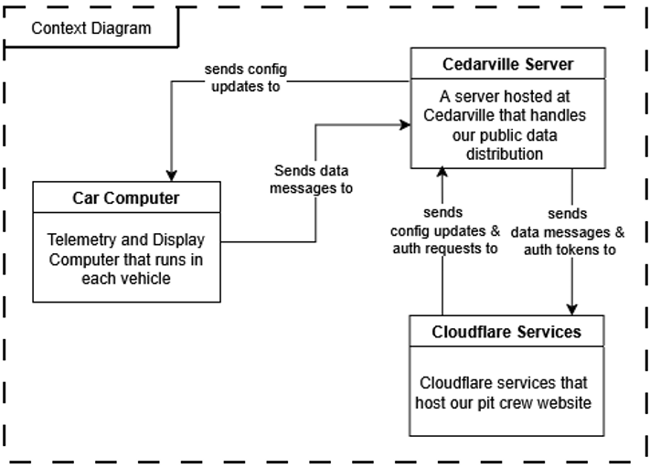

This page goes into the general details of what our computer systems do, how they integrate with the car, and what all parts are needed for it to work.  

## Why do we even need a Computer System?
This is a good question, since having an extra electrical component in the car adds extra complexity and strain on the system. The answer is multi-faceted, as our computer actually serves multiple purposes for the team.

### 1. Data Collection
Arguably one of the most important uses, our computer serves as an integral part of the data requisition from the car. While computers like MegaSquirt collect data for the express purpose of controlling the engine, our system can track the overall performance of the car and their drivers. We can track metrics such as vehicle speed, battery voltage, engine temperature, car status and more. This allows the other team members to analyze the performance of the car, and simulate the car to find how the car could theoretically perform in different conditions.

### 2. Driver Telemetry
While having the data for the engineers of the team is a vital function, the other half of our responsibility is to display some of this data to the drivers. They need to know a summary of how the car is driving and functioning, allowing them to make decisions about when to run the engine, when to coast, and what decisions need to be made about the mechanical condition of the car. This is all shown on a 7-inch display mounted inside the car, which we will discuss in a bit more detail later.

## How It Works
Now we will dig into some of the more technical details about how our system functions. Below you will see a high-level overview diagram of what our architecture consists of. We are going to explore this one box at a time. Visit the links in the table of contents to view the information for each.

