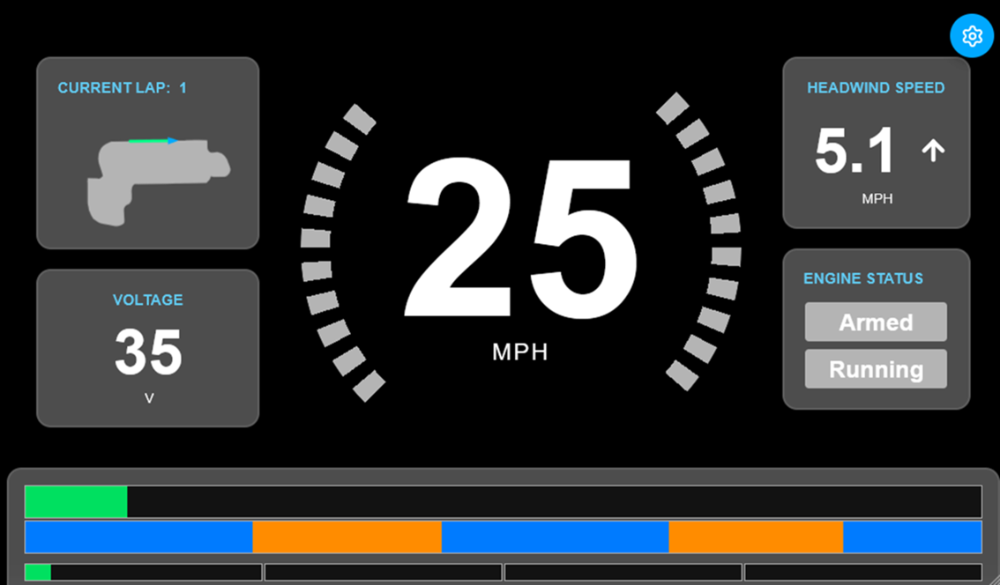
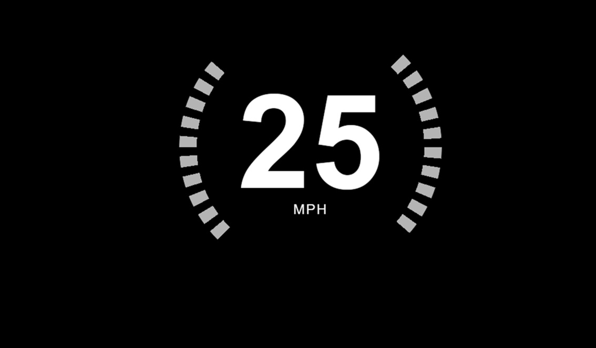
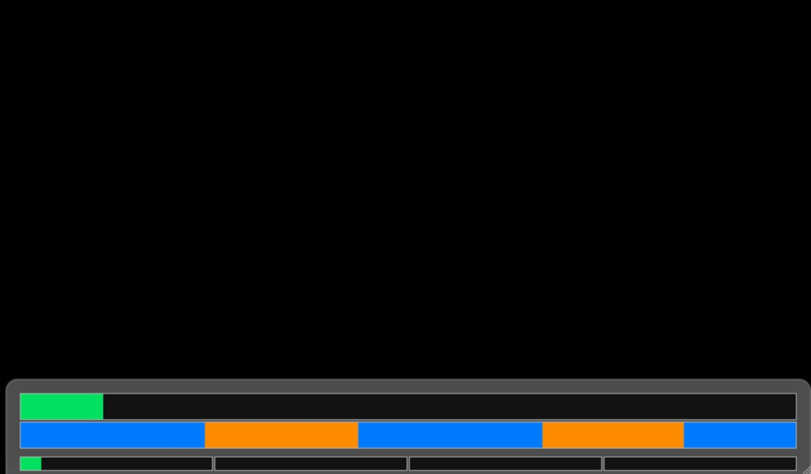
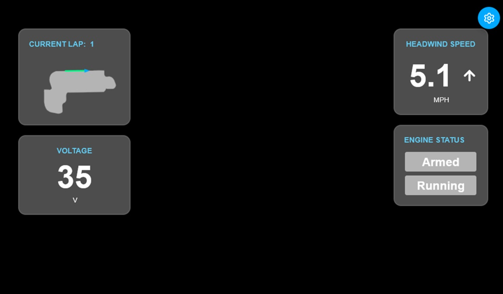

The driver display is the UI that drivers see in the car. It gives them vital information about the vehicle so that they can optimize their driving strategy accordingly.

## UI Elements

Below you will see a walkthrough of the different UI elements and what they mean for the driver.

### Speedometer

The speedometer is a special widget that contains two pieces of functionality. The first, and most obvious, is the readout in the center that gives the current speed of the car, in MPH.

The second bit of functionality has to do with the curved bars on the left and right sides. When the simulation is being run, these can function as a countdown to tell the driver when to start and when to stop the engine. This allows for a distinct, clear indicator to the driver what the simulation is telling them to do, reducing the level to which they have to think about it.

### Burn-Coast Simulation Widget

This widget is vital to nailing down the driving strategy during a race. It encapsulates a lot of information into a simple, graphical interface of 3 different progress bars.

Going from top to bottom, the first progress bar tells the driver what they have already done, within the current lap. It is a distance-based progress bar, with two colors: green for coasting, and yellow for burning. This way, the driver can see their progress at a glance.

The second bar is the simulation bar. It tells the driver at which points they are supposed to burn the engine (orange), and at which points they should be coasting (blue). By comparing this bar with the above, the driver can see how closely they are aligning with the optimal strategy.

The bottom bar is divided into laps, and shows the driver's current progress across the entire race. So, using the same colors as the first bar, the driver can see how far along in the entire race they are at a glance.

The data itself comes from the MATLAB simulation code that was developed by the Supermileage team over the last couple years. It can be controlled using the [Pit Crew Dashboard](./pit-crew-website.md).

### Minor Widgets

These widgets give the driver acillary information about the car. For example, the battery status or the engine status. It also give some other metrics about driving that are useful, but not necessary. The map gives a visual of where there driver is on the track at any given point. The Headwind Speed widget tells them the windspeed relative to the car. This is important if the driver is adopting the strategy of trying to chase the wind, which is especaily relevant for the electric car which can run at a constant velocity.

## User Interaction

Since the driver has quite limited mobility when inside the cars, there is limited ability for the driver to interact with the display. There is one exception of buttons that can be hooked up in each car. These buttons can control functions such as reseting the counters on the display (such as distance travelled) and starting and stopping timers (if applicable). 

In the current setup, when buttons are connected to the computer system, they reset everything on the display in order to start a race. That way, the data being received is as synchronized as possible with the race.

### Location

Different cars have different locations for the buttons. Discuss with the Electrical Team for which buttons and/or switches are connected for us.

* **Karcharias:** in the left stearing control.
* **Sting:** one of the switches in the center of the steering wheel serves this function.

### Computer Box Setup

There is a 4-pin connector in the side of the computer box. This is where the user input buttons come into the box and are hooked up to our system. If for whatever reason it cannot be plugged in, the computer will still function as normal.