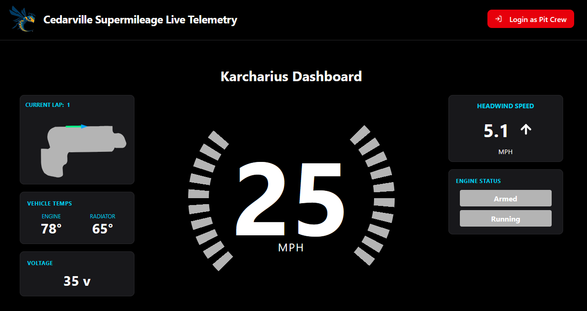
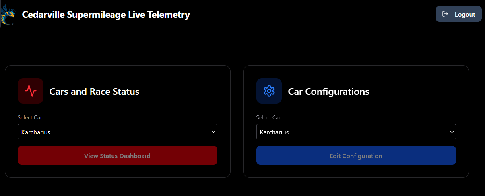
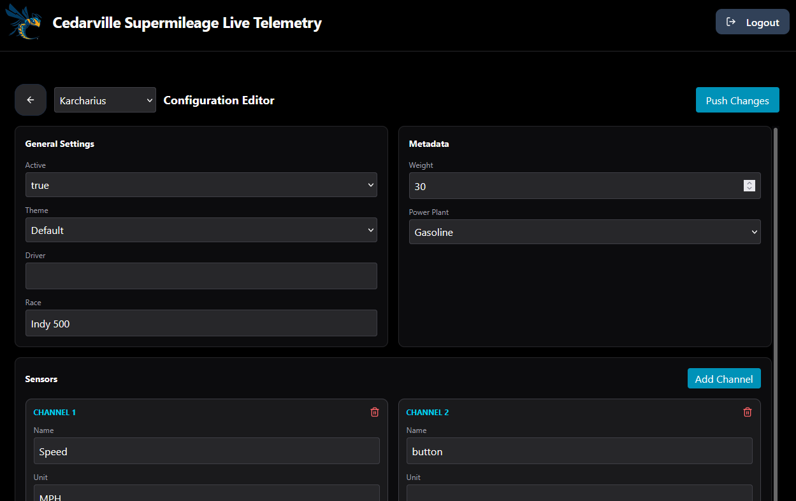

The pit crew website serves as the user interface between the pit crew and the car computers. You can view the telemetry status of the cars, modify simulation data, and modify computer configurations on the fly.

[supermileage.cedarville.edu](https://supermileage.cedarville.edu)

## General Navigation

The website has two main landing pages: a guest page and the pit crew page. 

### Guest Page

The guest page is the primary landing page when navigating to the website. It will present basic telemetry information for one of the cars currently on the track, and that is about it. It provides no interaction with the cars themselves. It is intended to allow for non-team members to be able to see how our cars are doing. It also provides the button to login to the pit crew side of the site.

### Pit Crew Page

The pit crew page can only be accessed via the login on the guest page. Once authenticated, you will be presented with a dashboard with two options: telemetry dashboards and car configuration. Each option allows for selecting any of the active vehicles. 

## Telemetry

The primary function of the Pit Crew website is to allow the pit crew to monitor the status of the cars remotely, while they are on the track. As described above, there are two locations to monitor this: the guest page, and the pit crew telemetry dashboard. 

The pit crew dashboard provides telemetry dashboards for all of the cars. These differ from the guest page by including more information, and allowing for some manipulation of the data that is being presented to the driver, for example, the simulation data (coming soon, also see Simulation section below).

Currently, the two telemetry locations do not differ much in appearance, so a separate screenshot is not included here.

## Simulation

The eventual goal of the website was that the pit crew would be able to send data updates to the cars remotely, so that the drivers would always have up-to-date information. This is quite important for things like the simulation, which could change due on the dynamic nature of the track. Unfortunately, we were not able to fully integrate the simulation controls into the site. There is work planned to establish this functionality in the near future. See the [github repository for the site](https://github.com/HEEV/supermileage-display-web-pits) for more information.

## Configuration

The car configuration page allows the pit crew to adjust the sensor input labels and other metadata that are attached to particular sensor channels. This means that if a new sensor needs to be added, or sensors moved around on the hardware to accommodate race day changes, it can be done quickly. For more information about the sensor channeling, [see this page](../car-computer.md#arduino-firmware). *Note: this functionality is still experimental, so it may not always behave as expected.*
